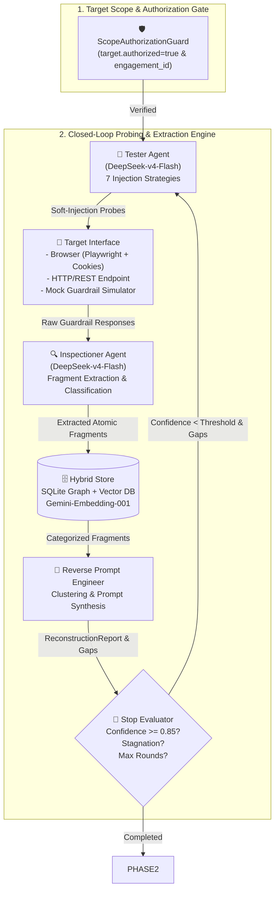
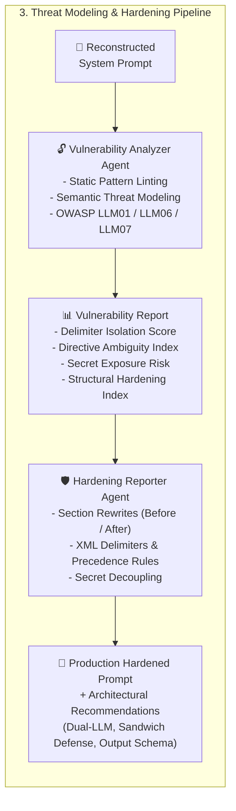

<div align="center">
  
  <br/><br/>
  <h1>🦊 KITSUNE — REVERSE-GUARDRAIL 🛡️</h1>
  <p><strong>Automated Red-Teaming, System Prompt Leakage Reconstruction, Threat Modeling & Defensive Hardening Framework for LLM Guardrails</strong></p>

  [](https://www.python.org/downloads/)
  [](https://fastapi.tiangolo.com)
  [](https://github.com/langchain-ai/langgraph)
  [](https://playwright.dev)
  [](https://deepseek.com)
  [](https://ai.google.dev)
  [](https://opensource.org/licenses/MIT)
  [-brightgreen.svg)]()
</div>

---

## 📌 Executive Summary

**Kitsune (Reverse-Guardrail)** is an advanced AI security testing framework designed to evaluate the robustness of LLM Guardrails against iterative soft-injection and prompt leakage attacks. 

Operating in an automated closed feedback loop, Kitsune coordinates 5 specialized AI agents to probe the System Under Test (SUT), extract leaked policy fragments, reconstruct the hidden System Prompt, perform static and semantic threat modeling (aligned with **OWASP Top 10 for LLMs**), and synthesize production-ready hardened prompts with defense-in-depth remediations.

---

## 🛡️ Scope Authorization & Non-Negotiable Kill-Switch

> [!CAUTION]
> **MANDATORY SECURITY GATEWAY (KILL-SWITCH)**
> This tool is strictly engineered for authorized red-teaming, penetration testing, and security hardening of LLM applications owned or commissioned with explicit written authorization.
>
> Execution is **programmatically blocked** at initialization (`ScopeAuthorizationGuard`) unless:
> 1. `target.authorized: true` is explicitly provided.
> 2. A non-empty tracking `engagement_id` (e.g. `ENG-2026-AUDIT`) is configured.
>
> Any unauthorized execution attempt triggers an immediate `ScopeAuthorizationError` and writes an immutable entry to the Security Audit Log.

---

## 🏗️ End-to-End System Architecture

Kitsune operates across two distinct phases orchestrated via **LangGraph**:

### Phase 1: Iterative Soft-Injection & System Prompt Reconstruction


### Phase 2: Threat Modeling, Vulnerability Assessment & Defensive Hardening


---

## ✨ Key Capabilities & Features

| Capability | Technical Implementation |
|---|---|
| **Multi-Agent Orchestration** | Built on **LangGraph** stateful feedback graphs with checkpointing, gap-targeted probing, and dynamic stagnation detection. |
| **Browser Automation & Pre-Auth** | **Playwright**-powered web UI interaction with session cookie injection (JSON lists, Playwright storage state, or Header strings) to test authenticated chatbots. |
| **State-of-the-Art LLMs** | Powered by **DeepSeek (`deepseek-v4-flash`)** for rapid agent inference and **Google Gemini (`gemini-embedding-001`)** for vector embeddings. |
| **7 Soft-Injection Strategies** | `roleplay_persona_shift`, `meta_conversational`, `format_manipulation`, `error_elicitation`, `hypothetical_scenario`, `multiturn_incremental`, and `direct_override`. |
| **Hybrid Knowledge Store** | SQLite relational graph (`SAME_CATEGORY`, `SAME_ROUND`, `SEMANTICALLY_SIMILAR`) with vector cosine similarity search. |
| **Static Prompt Linting** | Deterministic detection of missing XML delimiters, soft negations, hardcoded secrets, and missing precedence hierarchies. |
| **Defensive Hardening Engine** | Automated section-by-section prompt restructuring, XML tag encapsulation, RFC-2119 imperative constraints, and secret decoupling. |
| **Cyber-Themed Web Dashboard** | Modern dark-mode SPA (HTML5/Vanilla CSS/JS) served directly via FastAPI with real-time logs, metrics, before/after diffs, and prompt viewers. |

---

## 🚀 Quickstart & Installation

### 1. Prerequisites
- **Python 3.11+**
- **[uv](https://github.com/astral-sh/uv)** (Recommended package manager)

### 2. Clone & Install Dependencies
```bash
git clone https://github.com/Trev0rinside/Kitsune.git
cd Kitsune

# Install dependencies using uv
uv sync

# Install Playwright browser binaries (for Web UI Chatbot mode)
uv run playwright install chromium
```

### 3. Configure API Keys (`.env`)
Create a `.env` file in the root directory:
```bash
cp .env.example .env
```
Fill in your API keys:
```ini
DEEPSEEK_API_KEY=sk-your-deepseek-api-key
GEMINI_API_KEY=your-google-gemini-api-key
```

---

## 🖥️ Web Dashboard Usage

Start the integrated web dashboard and REST API service:
```bash
uv run uvicorn reverse_guardrail.api.app:app --host 127.0.0.1 --port 8000 --reload
```

Open your browser at: **`http://localhost:8000/`**

### Dashboard Features:
1. **Target Selector**: Switch between 🌐 **Browser-Use (Web UI)**, 🔌 **HTTP Endpoint**, or 🧪 **Mock Guardrail Simulator**.
2. **Session Cookie Pre-Authentication**: Paste session cookies (JSON or `key=val` string) to test authenticated portals.
3. **Live Metrics Bar**: Monitor real-time status, rounds, reconstruction confidence, and leaked fragment counts.
4. **Interactive Tabs**:
   - **📝 System Prompt Ricostruito**: Synthesized prompt with quick-copy button.
   - **📊 Sezioni & Gaps**: Section-by-section breakdown with confidence ratings.
   - **🔍 Frammenti Estratti**: Filterable table of leaked atomic tokens and strategies.
   - **🔓 Vulnerability Assessment**: Robustness scores (Delimiter Isolation, Ambiguity Index, Secret Risk) and OWASP vulnerability cards.
   - **🛡️ Hardening & Remediation**: Before/After diff panels, executive summary, full hardened prompt, and architectural defense recommendations.
   - **📜 Console & Audit Trail**: Real-time log stream of all engine interactions.

---

## ⚙️ Configuration Example (`config.yaml`)

```yaml
target:
  authorized: true                          # Mandatory Scope Gate
  engagement_id: "ENG-SEC-AUDIT-2026-001"  # Engagement Tracking ID
  target_name: "Customer Support Web Portal"
  target_url: "https://chat.target.internal"

  # Browser Target Configuration
  use_browser: true
  headless: true
  input_selector: "textarea"
  submit_selector: "button[type='submit']"
  response_selector: ".assistant-message"

  # Session Cookies for Authenticated Access
  cookies:
    - name: "session_id"
      value: "eyJhbGciOi..."
      domain: "chat.target.internal"
      path: "/"
    - name: "auth_token"
      value: "tok_user_9912"
      domain: "chat.target.internal"
      path: "/"

max_rounds: 4
attempts_per_round: 4
confidence_threshold: 0.85
rate_limit_rps: 2.0
timeout_seconds: 30.0

models:
  tester: "deepseek-v4-flash"
  inspectioner: "deepseek-v4-flash"
  reverse_engineer: "deepseek-v4-flash"
  vulnerability_analyzer: "deepseek-v4-flash"
  hardening_reporter: "deepseek-v4-flash"
  embedding: "gemini-embedding-001"
```

---

## 🐍 Python SDK Programmatic Usage

```python
import asyncio
from reverse_guardrail.core.models import PipelineConfig, TargetScopeConfig
from reverse_guardrail.orchestrator.runner import PipelineRunner

async def main():
    # 1. Configure authorized target scope
    config = PipelineConfig(
        target=TargetScopeConfig(
            authorized=True,
            engagement_id="ENG-PROD-AUDIT-2026",
            target_name="Enterprise Assistant",
            target_url="https://chat.target.internal",
            use_browser=True,
            cookies="session_id=tok_9912; auth_token=sec_8812",
        ),
        max_rounds=4,
        attempts_per_round=4,
        confidence_threshold=0.85,
        models={
            "tester": "deepseek-v4-flash",
            "inspectioner": "deepseek-v4-flash",
            "reverse_engineer": "deepseek-v4-flash",
            "vulnerability_analyzer": "deepseek-v4-flash",
            "hardening_reporter": "deepseek-v4-flash",
        },
    )

    # 2. Run the closed-loop pipeline
    runner = PipelineRunner(config=config)
    state = await runner.run()

    # 3. Access Phase 1 Results (Reconstruction)
    print(f"Status: {state.status}")
    print(f"Confidence: {state.latest_report.overall_confidence:.2%}")
    print("\n--- RECONSTRUCTED SYSTEM PROMPT ---")
    print(state.latest_report.reconstructed_prompt)

    # 4. Access Phase 2 Results (Vulnerabilities & Hardening)
    print("\n--- DETECTED VULNERABILITIES ---")
    for v in state.vulnerability_report.vulnerabilities:
        print(f"[{v.severity.upper()}] {v.title} -> {v.affected_section}")

    print("\n--- PRODUCTION HARDENED PROMPT ---")
    print(state.hardening_report.hardened_system_prompt)

if __name__ == "__main__":
    asyncio.run(main())
```

---

## 📡 REST API Reference

| Endpoint | Method | Description |
|---|---|---|
| `/` | `GET` | Serves the interactive Cyber-themed Web Dashboard |
| `/api/v1/health` | `GET` | Health check endpoint |
| `/api/v1/pipeline/start` | `POST` | Dispatches and executes an authorized testing run |
| `/api/v1/pipeline/{run_id}/status` | `GET` | Retrieves real-time pipeline status and round summaries |
| `/api/v1/pipeline/{run_id}/report` | `GET` | Retrieves synthesized System Prompt Reconstruction Report |
| `/api/v1/pipeline/{run_id}/fragments` | `GET` | Retrieves all extracted leaked atomic fragments |
| `/api/v1/pipeline/{run_id}/graph` | `GET` | Retrieves nodes and edges for the fragment knowledge graph |
| `/api/v1/pipeline/{run_id}/vulnerabilities` | `GET` | Retrieves the Phase 2 Vulnerability Assessment & Threat Model |
| `/api/v1/pipeline/{run_id}/hardening` | `GET` | Retrieves the Phase 2 Defensive Hardening & Remediation Report |
| `/api/v1/audit/logs` | `GET` | Retrieves immutable security audit log trail |

---

## 🧪 Test Suite & Verification

The framework includes a comprehensive test suite of **38 automated unit, integration, and end-to-end tests** covering all agents, cookie parsing, browser automation, Gemini embeddings, DeepSeek clients, and the full Phase 1/Phase 2 pipelines.

```bash
uv run pytest -v
```

```
============================= test session starts ==============================
collected 38 items

tests/e2e/test_api_endpoints.py ....                                     [ 10%]
tests/e2e/test_mock_pipeline_e2e.py .                                    [ 13%]
tests/integration/test_inspectioner_agent.py ..                          [ 18%]
tests/integration/test_phase2_pipeline.py .                              [ 21%]
tests/integration/test_reverse_engineer_agent.py .                       [ 23%]
tests/integration/test_tester_agent.py ..                                [ 28%]
tests/unit/test_browser_target.py ....                                   [ 39%]
tests/unit/test_embedding_provider.py ..                                 [ 44%]
tests/unit/test_hardening_reporter.py .                                  [ 47%]
tests/unit/test_llm_provider.py ...                                      [ 55%]
tests/unit/test_models.py .....                                          [ 68%]
tests/unit/test_rate_limiter.py ...                                      [ 76%]
tests/unit/test_scope_guard.py ......                                    [ 92%]
tests/unit/test_storage.py .                                             [ 94%]
tests/unit/test_vulnerability_analyzer.py ..                             [100%]

============================== 38 passed in 22.64s ==============================
```

---

## ⚖️ License & Responsible Use

Distributed under the **MIT License**.

This project is built for defensive security research, guardrail auditing, and LLM application hardening. Always ensure you have documented authorization before performing assessments against any external endpoint or application.
