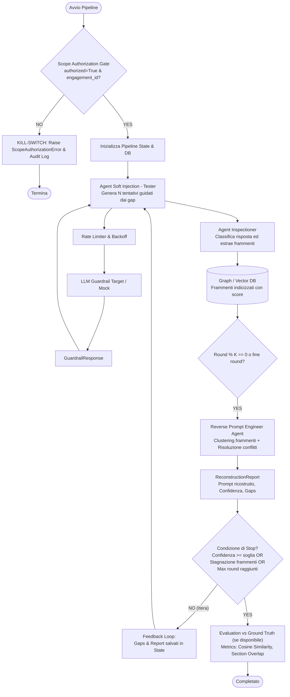

# Reverse-Guardrail — Architecture Diagram

```mermaid
flowchart TD
    Start(["Avvio Pipeline"]) --> ScopeGate{"Scope Authorization Gate<br/>authorized=True & engagement_id?"}
    ScopeGate -- "NO" --> KillSwitch["KILL-SWITCH: Raise ScopeAuthorizationError & Audit Log"] --> Abort(["Termina"])
    ScopeGate -- "YES" --> InitState["Inizializza Pipeline State & DB"]

    InitState --> Tester["Agent Soft Injection - Tester<br/>Genera N tentativi guidati dai gap"]
    Tester --> RateLimit["Rate Limiter & Backoff"]
    RateLimit --> SUT["LLM Guardrail Target / Mock"]
    SUT --> GuardrailResp["GuardrailResponse"]
    GuardrailResp --> Tester

    Tester --> Inspectioner["Agent Inspectioner<br/>Classifica risposta ed estrae frammenti"]
    Inspectioner --> DB[("Graph / Vector DB<br/>Frammenti indicizzati con score")]

    DB --> CheckEval{"Round % K == 0 o fine round?"}
    CheckEval -- "YES" --> RevEng["Reverse Prompt Engineer Agent<br/>Clustering frammenti + Risoluzione conflitti"]
    RevEng --> Report["ReconstructionReport<br/>Prompt ricostruito, Confidenza, Gaps"]
    
    Report --> StopCondition{"Condizione di Stop?<br/>Confidenza >= soglia OR<br/>Stagnazione frammenti OR<br/>Max round raggiunti"}
    
    StopCondition -- "NO (Itera)" --> Feedback["Feedback Loop:<br/>Gaps & Report salvati in State"] --> Tester
    StopCondition -- "YES" --> Eval["Evaluation vs Ground Truth (se disponibile)<br/>Metrics: Cosine Similarity, Section Overlap"] --> Finish(["Completato"])
```
