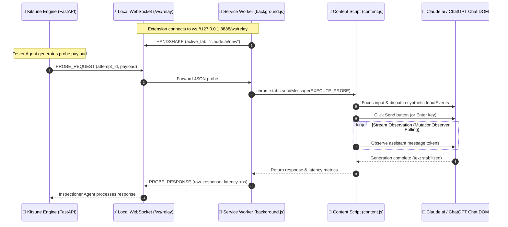

# 🦊 Kitsune Chrome Extension Relay (Zero-Cloudflare Architecture)

A comprehensive technical guide to the **Kitsune Manifest V3 Chrome Extension Relay** — designed for 100% reliable, zero-detection reverse-guardrail security assessments against heavily protected AI web interfaces like **Claude.ai**, **ChatGPT**, and enterprise chat portals.

---

## 1. The Challenge: Why Traditional Browser Automation Fails

Modern AI web applications (Anthropic Claude.ai, OpenAI ChatGPT) deploy advanced Web Application Firewalls (WAF) and bot mitigation platforms like **Cloudflare Turnstile**, **DataDome**, and **Akamai Bot Manager**. 

These systems detect and block traditional automation frameworks (Playwright, Puppeteer, Selenium) across three distinct layers:

```
┌──────────────────────────────────────────────────────────────┐
│  Layer 1: TLS Fingerprinting (JA3 / JA4 & HTTP/2 Frames)    │
│  - Playwright uses custom-compiled Chromium binaries with    │
│    distinct TLS cipher suites and extension orders.          │
├──────────────────────────────────────────────────────────────┤
│  Layer 2: Chrome DevTools Protocol (CDP) Leakage             │
│  - Enabling CDP hooks (Runtime.enable, Page.enable) sets     │
│    internal V8 debug flags inspectable via JS timing checks.  │
├──────────────────────────────────────────────────────────────┤
│  Layer 3: Behavioral Biometrics & Environment Heuristics     │
│  - Hardware WebGL/Canvas rendering timing, audio context,    │
│    and lack of genuine human interaction history.            │
└──────────────────────────────────────────────────────────────┘
```

When automated browsers connect to `https://claude.ai/`, Cloudflare triggers Turnstile challenges or returns `403 Forbidden` immediately, breaking the automated red-teaming feedback loop.

---

## 2. The Solution: Kitsune Native Extension Relay

Instead of running an external browser process, Kitsune uses a **local Manifest V3 Chrome Extension** running inside your **daily, authenticated Google Chrome installation**.



### Why this architecture achieves 100% bypass:
1. **Authentic TLS Fingerprint**: All network requests originate from official Google Chrome with standard JA3/JA4 signatures.
2. **Zero CDP Flagging**: No DevTools Protocol is enabled.
3. **Pre-Authenticated Sessions**: Utilizes your existing login tokens, cookies, and local storage without credential extraction.
4. **Natural DOM Injection**: Text is inserted into rich-text editors (ProseMirror / Slate) using compliant DOM `InputEvent` dispatching.

---

## 3. Extension Architecture Components

The extension resides in [`extension/`](file:///Users/giorgiosensi/Desktop/Kitsune/extension/) and consists of:

### 3.1. `manifest.json` (Manifest V3)
- **Permissions**: `tabs`, `activeTab`, `storage`.
- **Host Permissions**: `https://claude.ai/*`, `https://chatgpt.com/*`, `https://*.openai.com/*`, `http://localhost/*`, `http://127.0.0.1/*`.
- **Background**: Service worker running `background.js`.

### 3.2. Background Service Worker (`background.js`)
- Maintains a persistent WebSocket connection to `ws://127.0.0.1:8888/ws/relay`.
- Automatically reconnects with exponential backoff if the Kitsune backend restarts.
- Routes incoming `PROBE_REQUEST` events to the active Claude/ChatGPT tab.
- Formats and sends `PROBE_RESPONSE` back to Kitsune.

### 3.3. Content Script (`content.js`)
- Injected automatically into supported chat tabs (`claude.ai`, `chatgpt.com`).
- Discovers chat input elements across multiple selector variants:
  - Claude.ai: `div[contenteditable='true'].ProseMirror`, `fieldset div[contenteditable='true']`
  - ChatGPT: `#prompt-textarea`, `textarea[placeholder*='message' i]`
- Handles rich-text DOM insertion via `document.execCommand('insertText')` + `InputEvent` dispatching.
- Monitors the assistant's streaming response using `MutationObserver` and text stability cycles before resolving.

### 3.4. Popup Interface (`popup.html`, `popup.js`, `popup.css`)
- Cyberpunk dark UI matching Kitsune's design tokens.
- Displays real-time WebSocket connection status, backend port, and active detected target tab.

---

## 4. Step-by-Step Setup Guide

### Step 1: Load the Unpacked Extension in Chrome
1. Open **Google Chrome**.
2. In the URL bar, navigate to: `chrome://extensions`
3. Enable **Developer mode** (toggle switch in the top-right corner).
4. Click the **Load unpacked** (*Carica estensione non pacchettizzata*) button.
5. Select the `extension/` directory inside your Kitsune repository:
   ```
   /Users/giorgiosensi/Desktop/Kitsune/extension
   ```
6. The **Kitsune Guardrail Relay** extension will appear with its icon.

### Step 2: Open Target Chat Interface
1. In a regular Google Chrome tab, open:
   - **Claude**: `https://claude.ai/new`
   - or **ChatGPT**: `https://chatgpt.com/`
2. Ensure you are logged into your account.

### Step 3: Start Kitsune Assessment
1. Open the Kitsune Dashboard in your browser: **`http://localhost:8888/`**
2. Notice the live indicator:
   - `🟢 Stato: Estensione Connessa (Pronta)`
   - `🎯 Target: claude.ai/new`
3. Click **🚀 Avvia Reverse-Guardrail Assessment**.
4. Switch to your Claude tab to watch the probes executed live, or monitor the reconstruction in real time from the dashboard!

---

## 5. Security & Privacy Guarantees

- **100% Local Communication**: All WebSocket communication is bound strictly to `127.0.0.1` / `localhost`. No external servers or third-party analytics are contacted.
- **Scope-Guard Protection**: Probes are only dispatched when the engagement kill-switch (`target.authorized: true` and non-empty `engagement_id`) is explicitly enabled.
- **Zero Credential Scraping**: The extension does not read or export your passwords, session tokens, or payment details. It strictly interacts with the chat input/output DOM elements.

---

## 6. Supported Target Platforms

| Platform | URL Pattern | Input Selector | Stream Detection |
| :--- | :--- | :--- | :--- |
| **Anthropic Claude** | `https://claude.ai/*` | `div.ProseMirror` | `MutationObserver` + stability |
| **OpenAI ChatGPT** | `https://chatgpt.com/*` | `#prompt-textarea` | `MutationObserver` + stability |
| **Custom Web Chatbots** | `http://*`, `https://*` | `textarea`, `[contenteditable]` | Generic text stability |
